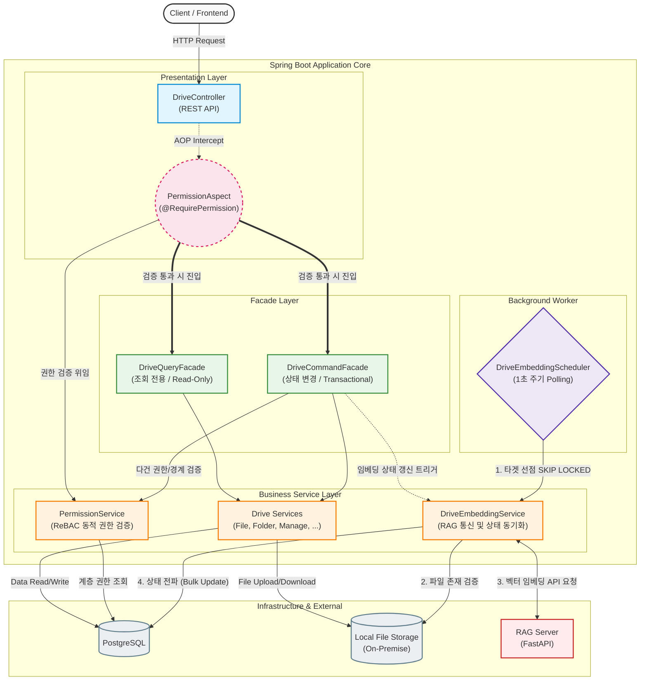
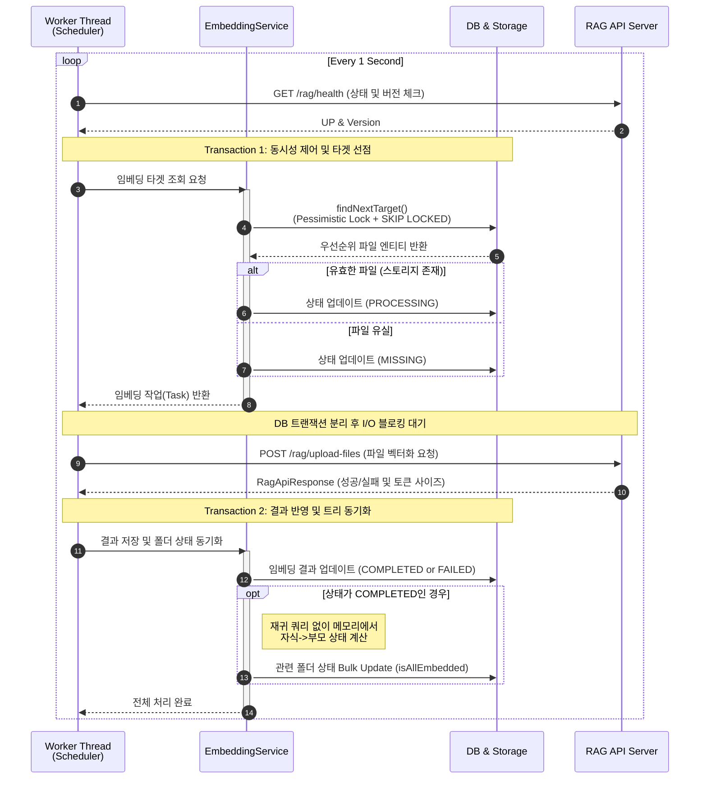
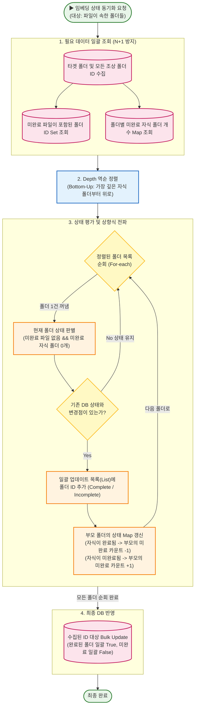
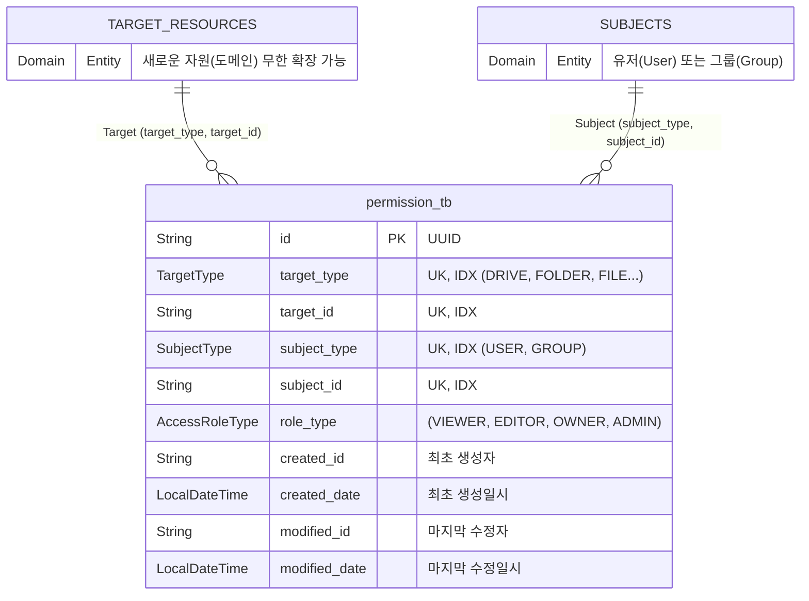
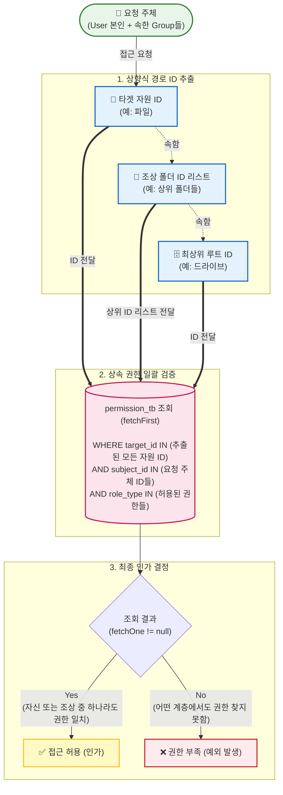
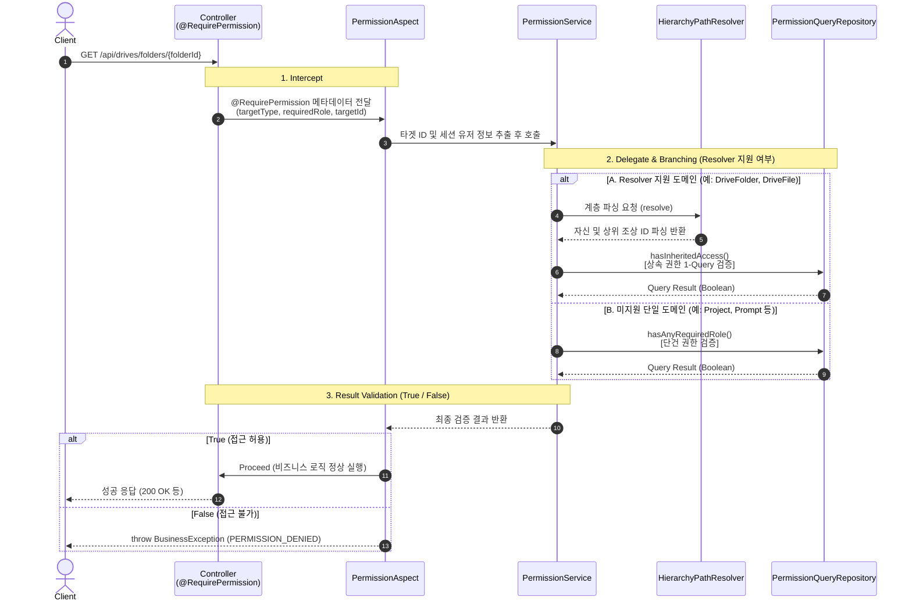
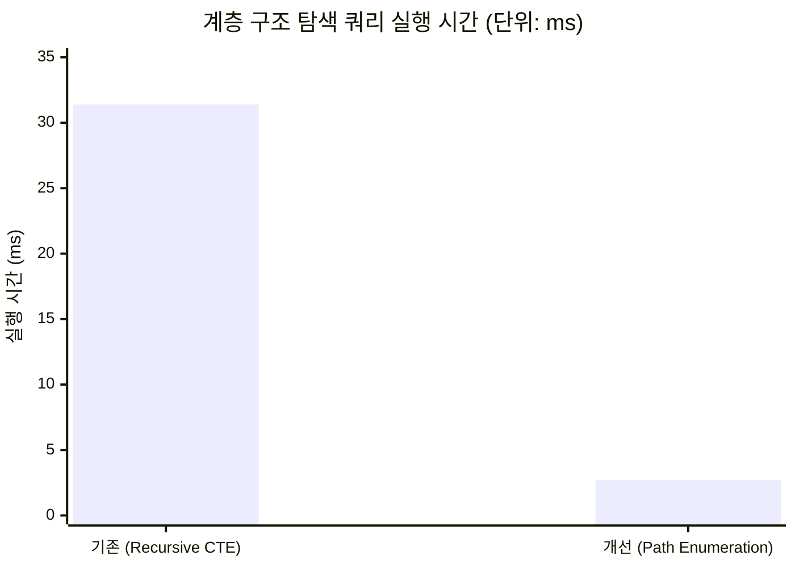
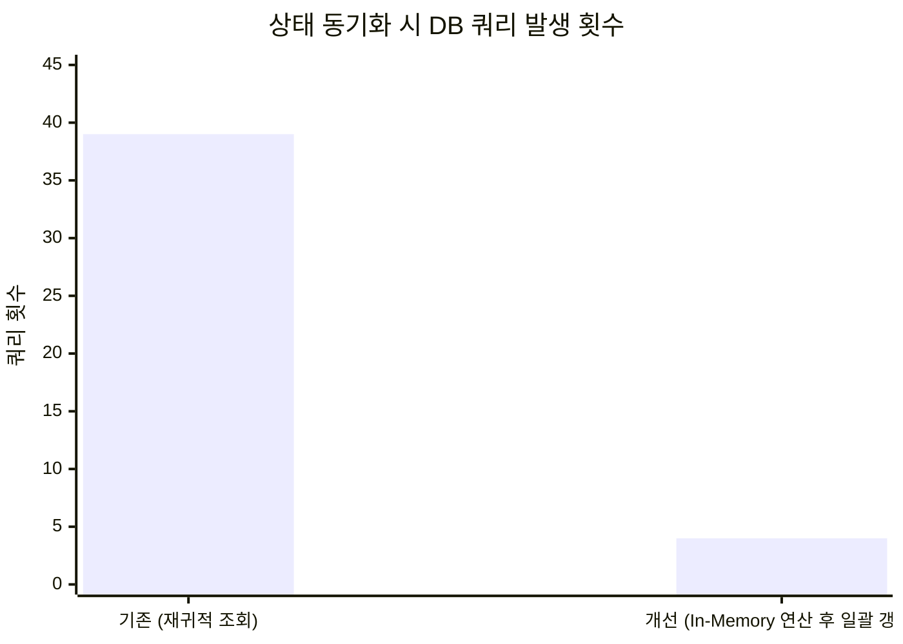

# 코어 시스템 아키텍처 설계 의도 및 특징 & 성능 최적화 검증

## 0. 시스템 개요 및 아키텍처 흐름

**[시스템 아키텍처 다이어그램]**


**계층별 주요 역할**
- **Presentation Layer**: 클라이언트 요청을 수신하며, AOP(`@RequirePermission`)를 통해 비즈니스 로직 진입 전 단건 자원에 대한 권한을 검증합니다.

- **Facade Layer**: 여러 도메인 서비스(폴더, 파일, 권한 등)가 복합적으로 얽히는 작업의 트랜잭션 경계를 설정하고 오케스트레이션을 담당하여 서비스 간 순환 참조를 방지합니다.

- **Business Service Layer**: 드라이브 데이터 제어, 다형성 기반 권한 검증(ReBAC) 등 각 도메인의 핵심 비즈니스 로직을 처리합니다.

- **Background Worker**: RDB의 `SKIP LOCKED`를 활용해 대상을 선점하는 즉시 상태를 `PROCESSING`으로 변경하며 트랜잭션을 종료하고 벡터 임베딩을 동기로 요청합니다. 메인 스레드와는 분리된 단일 스레드에서 타겟을 한 건씩 조회하여 순차적으로 임베딩 파이프라인을 처리합니다.


<br>

## 1. 드라이브 시스템

### 1-1. 아키텍처 설계 및 트레이드오프
- **문제 인식:** 디렉토리 관리에 단일 부모-자식 ID 참조(Adjacency List) 방식만 사용할 경우, 직속 하위(1-Depth) 탐색에는 유리하지만 **하위/상위의 모든 계층 자원 (N-Depth)**을 탐색할 때 재귀 쿼리를 발생시켜 트리의 깊이가 깊어질수록 DB I/O 부하가 커집니다.

- **해결책 (경로 열거 패턴 도입):** DB 무결성 보장(`동일 폴더 내 이름 중복 방지`) 및 1-Depth 탐색 성능을 위해 기존 인접 목록 방식(`parent_folder_id`)을 유지하면서, 다중 계층(N-Depth) 탐색 성능을 끌어올리기 위해 logicalPath (예: `/uuidA/uuidB/uuidC/`) 컬럼을 도입했습니다. logicalPath에는 자기 자신의 UUID도 포함되며, 컬럼 길이 제한 및 성능을 고려해 최대 깊이는 12로 제한했습니다.

- **조회 성능 향상** 
   - **하위 자원 전체 조회:** startsWith (`LIKE '/uuid/.../%'`) 연산과 PostgreSQL의 `varchar_pattern_ops` 인덱스를 결합하여, 하위 폴더/파일 전체 조회를 인덱스 스캔을 타는 1번의 쿼리로 최적화했습니다.

   - **상위 자원 전체 조회:** 엔티티의 `getAncestorFolderIds()`를 통해 자기 자신을 포함한 모든 상위 폴더 ID를 logicalPath를 이용해 어플리케이션 메모리 단에서 파싱하고, IN 절을 활용해 1번의 쿼리로 모든 조상 폴더들을 조회할 수 있습니다.

- **트레이드오프 관리 (Read vs Write):** - 폴더 이동(`moveFolders`) 시 하위 폴더들의 `logicalPath`를 일괄 수정해야 하는 쓰기 비용이 발생합니다. 하지만 드라이브 도메인 특성상 **쓰기(수정)보다 조회(탐색) 빈도가 높다는 점, 그리고 권한 검증 및 폴더의 임베딩 상태 전파를 위해 상위 및 하위 자원들을 빈번하게 조회해야 하는 비즈니스 요구사항을 고려하여 트레이드오프를 선택**했습니다.

### 1-2. 대용량 데이터 쓰기 성능 및 정합성 보장
- **QueryDSL Bulk Update:** 폴더 이동(`moveItems`)이나 삭제(`deleteItems`) 등 하위 항목 전체에 대한 Update가 필요한 경우, JPA의 변경 감지가 아닌 QueryDSL 기반의 Bulk Update(`예: bulkUpdateDescendantsPathList`) 를 통해 성능 병목을 완화시켰습니다.

- **영속성 컨텍스트 관리:** Bulk 연산 수행 전 `em.flush()`로 보류된 쓰기를 동기화하고, 수행 후 `em.clear()`를 수행하여 1차 캐시와 DB 간의 데이터 불일치 문제를 예방하고 데이터 정합성을 보장하도록 했습니다.

### 1-3. Facade 아키텍처를 통한 트랜잭션 및 의존성 관리
- **문제 인식:** 폴더 이동, 파일 삭제, 권한 검증 등은 `DriveFolderService`, `DriveFileService`, `DrivePermissionService` 등 다수의 도메인 서비스가 복합적으로 얽히는 작업입니다. 이를 단일 서비스에서 모두 처리하려 할 경우, 비즈니스 로직의 전체적인 흐름을 따라가기 어려워지고 코드의 가독성이 저하되어 유지보수와 확장이 어려운 구조가 될 우려가 컸습니다.

- **해결책 (계층 분리 및 CQS):** 비즈니스 로직(Service)과 흐름 제어(Facade) 계층을 분리했습니다. 또한 데이터의 상태를 변경하는 `DriveCommandFacade`와 조회를 담당하는 `DriveQueryFacade`로 나누어 명령과 조회의 책임(CQS)을 논리적으로 분리했습니다.

- **트랜잭션 오케스트레이션:** 다중 도메인 서비스의 조합이 필요한 작업 시, Facade 계층의 메서드에서 트랜잭션의 시작과 끝을 제어합니다. 이를 통해 여러 작업을 하나의 논리적 트랜잭션(단일 작업 단위)으로 묶어 오케스트레이션함으로써 예외 발생 시 전체 롤백을 통한 정합성을 보장하도록 했습니다. (스프링 AOP 트랜잭션 기본 전파 옵션(`Propagation.REQUIRED`) 동작 원리에 따라, 하위 도메인 서비스의 트랜잭션은 분리되지 않고 Facade의 최상위 트랜잭션에 합류합니다.)

- **단일 책임 원칙:** Facade는 흐름 제어와 트랜잭션 경계 설정만 담당하고, 실제 비즈니스 로직은 하위 서비스로 위임하여 객체 지향적인 유연성과 단위 테스트 용이성을 향상 시켰습니다.

```text
[Presentation Layer]
DriveController (REST API)
 │
 ├── [Facade Layer : 트랜잭션 경계 & 비즈니스 오케스트레이션]
 │    │
 │    ├── DriveQueryFacade (조회 전용, @Transactional(readOnly = true))
 │    │    ├── DriveFolderService
 │    │    ├── DriveFileService
 │    │    ├── DriveRefService
 │    │    └── DriveManageService 
 │    │
 │    └── DriveCommandFacade (상태 변경 전용, @Transactional)
 │         ├── DrivePermissionService (권한 경계 및 유효성 검증)
 │         ├── DriveRefService (AI 문서 참조 토큰 발급 및 조회)
 │         ├── DriveManageService (드라이브 관리)
 │         ├── DriveFolderService (폴더 제어)
 │         ├── DriveFileService (파일 제어)
 │         └── DriveEmbeddingService (임베딩 상태 동기화)
 │
[Background Worker Layer : 스케줄링]
DriveEmbeddingScheduler (FOR UPDATE SKIP LOCKED 제어)
 └── DriveEmbeddingService (독립적인 트랜잭션으로 임베딩 처리)
```

### 1-4. DB와 물리 스토리지 간의 분산 환경 정합성 보장
- **커넥션 풀 고갈 및 이중 쓰기 방어:** 파일 업로드 같은 긴 네트워크 I/O 작업 시 DB 트랜잭션을 점유하면 커넥션 풀 고갈 장애가 발생할 수 있습니다. 이를 예방하기 위해 스토리지 업로드 로직과 DB 트랜잭션을 분리했습니다. 이로 인해 시스템 간의 원자성이 어긋나는 고아 파일 이슈를 제어해야 했습니다.

- **실행 순서 및 보상 트랜잭션:** 물리 스토리지에 먼저 업로드한 뒤 DB 트랜잭션을 수행하며, DB 트랜잭션 커밋 실패 시 스토리지의 파일을 삭제하는 **보상 트랜잭션** 로직을 통해 데이터 무결성을 보장할 수 있도록 했습니다.

### 1-5. 최상위 루트 설계 및 API 진입점 분리
본 시스템의 디렉토리 구조는 최상위 루트를 물리적인 폴더로 생성하지 않고, 식별자를 `folderId = null`로 취급하는 가상 루트 방식을 채택했습니다. 더불어 조회 및 생성 시, 내 드라이브(`/my-drive`), 공유 드라이브(`/shares`), 일반 폴더(`/folders`)로 API 진입점을 분리했습니다. 이 아키텍처는 다음과 같은 설계적 의도와 트레이드오프를 갖습니다.

**가상 루트 및 API 분리를 채택한 설계적 의도**
- **도메인 책임 분리와 데이터 중복 방지:** 최상위 루트의 메타데이터(`이름, 소유자 등`)는 이미 드라이브 본연의 속성입니다. 이를 최상위 폴더로 한 번 더 생성하는 것은 데이터 중복이라 판단하여, 드라이브(`컨테이너`)와 폴더(`내부 자원`)의 도메인 역할을 분리했습니다.

- **구조적 조작 차단:** 최상위 루트가 물리적 폴더로 존재할 경우, 요청 입력으로 이를 삭제, 이동, 이름 변경하려 할 때 이를 막기 위한 방어 로직(`depth == 0`)이 서비스 레이어 곳곳에 강제됩니다. 가상 루트 방식은 폴더 조작 API의 대상 자체가 되지 않으므로 이러한 리스크를 사전에 차단할 수 있습니다.

**설계적 한계점**
- **클라이언트 라우팅 복잡성 증대 (다형성의 부재):** 모든 자원이 단일 폴더로 추상화되지 않기 때문에, 클라이언트는 브레드크럼(`상단 경로`)을 클릭할 때 단순히 `folderId`만으로 단일 API를 호출할 수 없습니다. 이를 해결하기 위해 백엔드 응답 모델에 `type` 필드(`MY_DRIVE`, `SHARED_DRIVE`, `DRIVE_FOLDER`)를 추가해야 했으며, 프론트엔드 역시 이 `type`에 따라 서로 다른 API 엔드포인트로 분기 라우팅을 처리해야 합니다.

- **객체지향적 처리의 한계:** 모든 계층이 동일한 폴더 속성을 가지지 않으므로, 트리 탐색이나 루트 검증을 수행할 때 서비스 레이어 곳곳에 `if (folderId == null)`과 같은 예외 분기문이 일부 잔존하게 되었습니다.

---
<br>

## 2. 벡터 임베딩 파이프라인과 폴더 임베딩 상태 동기화
파일이 업로드되면 AI가 읽을 수 있도록 벡터 임베딩하는 백그라운드 병렬 Worker와, 폴더 하위의 파일들의 임베딩 여부 상태에 따른 폴더 임베딩 상태를 동기화하는 로직입니다.

### 2-1. SELECT FOR UPDATE SKIP LOCKED 기반의 스케줄링
메모리 큐를 사용하면 서버 다운 시 작업 내역이 증발합니다. 이를 방지하기 위해 DB 테이블 자체를 안정적인 작업 대기열로 활용하며, `SELECT FOR UPDATE SKIP LOCKED`를 통해 다중 스레드 환경에서의 `Race Condition` 없이 병렬 처리합니다.

**[임베딩 스케줄러 동작 시퀀스 다이어그램]**


- **Worker Pool 기반 병렬 처리 및 부하 제어**
  - 외부 AI 모델(RAG 서버)의 과부하를 막기 위해, `FixedThreadPool`과 `AtomicInteger`를 통해 동시에 실행되는 API 요청 수를 `maxWorkers` 개수로 제한합니다.
  - 메인 클라이언트 요청을 처리하는 Tomcat 스레드와 임베딩 워커 스레드를 분리하여, 임베딩 지연이 일반 사용자의 API 호출 응답성에 영향을 주지 않도록 합니다.

- **동시성 제어** 
  - 다중 서버 및 다중 스레드 환경에서 동일한 파일에 중복 접근하는 것을 막기 위해 `SELECT FOR UPDATE SKIP LOCKED` 구문을 사용합니다. 경합이 발생해도 스레드가 대기하지 않고 다른 타겟을 찾습니다.
  - 타겟을 찾으면(선점하면) 상태를 `PROCESSING`으로 변경하고 트랜잭션을 커밋하여 DB 락을 해제합니다.
  - 이를 통해 DB 커넥션을 점유하는 시간을 최소화하며, 타 워커 스레드가 동일한 타겟에 접근하는 것을 막습니다.
  - 이후에 이루어지는 벡터 임베딩 API 요청은 DB 락과 트랜잭션이 해제된 상태에서 동기 작업으로 수행됩니다.

- **우선순위 기반 DB 폴링:** DB에서 6단계 우선순위에 따라 1건씩 타겟을 가져옵니다.
  1. **수동 요청 (PRIORITIZED):** 사용자가 명시적으로 최우선 처리를 요청한 파일
  2. **실패한 구버전 재처리 (FAILED 중 구버전):** 이전 모델에서 실패했던 파일의 우선 재시도
  3. **신규 업로드 파일 (READY):** 유저가 새로 업로드한 파일
  4. **완료된 구버전 마이그레이션 (COMPLETED 중 구버전):** 이미 서비스 중이나 새 버전 모델로 업데이트가 필요한 파일. **신규 파일(`READY`)의 처리를 지연시키지 않기 위해 우선순위를 후순위로 배치**했습니다.
  5. **좀비 태스크 복구 (PROCESSING - 30분 지연):** 인스턴스 다운 등의 이유로 `PROCESSING` 상태에서 멈춰서 방치된 태스크를 회수하여 재처리합니다.
  6. **일반 실패 재시도 (FAILED - 60분 경과):** OCR 모델의 처리 오류로 실패한 파일들의 주기적 재시도

- **물리적 존재 여부 검증:** 작업 할당 전 파일 스토리지(`fileStorageService`) 시스템 내 실제 존재 여부를 검증하여, 유실된 파일에 대해 무한 재시도를 하는 낭비를 막고 `MISSING` 상태로 격리합니다.

### 2-2. 폴더 임베딩 상태의 상향식 동기화

**[폴더 임베딩 상태 동기화 흐름]**



- **상태 전파의 복잡성:** 특정 하위 파일의 임베딩이 완료/실패 상태로 변경되면, 그 상태가 최상위 조상 폴더의 `isAllEmbedded` 상태까지 전파되어야 합니다 (`자식 -> 부모 -> 조상`).

- **상태 취합 및 일괄 업데이트:** 재귀적인 DB 쿼리 호출을 방지하기 위해, `updateFolderEmbStatusByFolderId` 내에서 타겟 폴더들의 트리 정보를 메모리에 올립니다. 이후 각 폴더의 미완료 자식 카운트(`incompleteChildCounts`)를 메모리상에서 계산하여 **Bottom-Up 방식으로 각 부모 폴더들의 최종 상태를 취합한 뒤, Bulk Update로 DB에 반영**합니다.

- 이 동기화 로직은 벡터 임베딩 스케줄러에 의한 임베딩뿐만 아니라 자원의 삭제, 이동, 임베딩 우선순위 변경 시에도 동일하게 호출되도록 되어있습니다.

---
<br>

## 3. ReBAC 기반 계층적 권한 제어 시스템
역할 기반(RBAC)과 함께, 자원 간의 계층적 관계를 해석하여 권한을 검증하는 관계 기반 접근 제어(ReBAC)를 구현했습니다.

### 3-1. 통합 권한 데이터 모델 설계

**[권한 테이블 ERD]**



도메인별로 권한 테이블(예: `project_permission`, `drive_permission` 등)을 분리하면 테이블이 너무 많아지고 권한 로직의 파편화가 발생합니다. 따라서 단일 `permission_tb` 테이블에서 공유가 가능한 모든 시스템 자원의 권한을 중앙 집중식으로 관리하는 단일 진실 공급원(`SSOT`)으로 설계했습니다. 

- **다형성 활용 및 OCP 준수:** `TargetType`과 `TargetId`를 통해 프로젝트, 프롬프트, 드라이브 등 어떤 형태의 신규 도메인이 추가되더라도 권한 테이블 스키마의 변경 없이 확장할 수 있습니다.

- **B2B 환경을 고려한 트레이드오프:** B2B 시스템 특성상 B2C 서비스 대비 **`TPS`가 제한적이고 예측 가능**한 반면, **새로운 기능과 도메인의 확장은 빈번**하게 일어납니다. 따라서 단일 테이블 구조로 인한 물리적 병목 리스크보다, **다형성을 활용한 시스템 확장성과 유지보수성 향상의 이점이 크다고 판단**했습니다.

- **성능 확장성 고려:** 추후 트래픽 증가로 인한 병목이 확인될 경우, `Redis` 등 인메모리 DB를 통한 캐싱 처리를 고려해 볼 수 있습니다.

### 3-2. 권한 상속 구조 설계 (Relationship-Based Access Control)
자원 간의 `부모-자식 관계`를 기반으로 권한이 상속되는 구조를 설계했습니다. 시스템 관점에서는 타겟 자원부터 조상으로 거슬러 올라가는 **상향식 권한 탐색**을 수행하며, 사용자 관점에서는 상위 자원의 권한이 하위로 누적되는 **하향식 권한 적용** 효과를 갖습니다.

**[1] 권한 상속 및 누적 메커니즘**
```text

🗄️ 최상위 드라이브 ── 부여된 권한: [User A : OWNER]
 │
 ├── 📁 상위 폴더 (폴더_1) ── 부여된 권한: [User B : EDITOR]
 │    │ 
 │    ├── 📁 하위 폴더 (폴더_1_1) ── 부여된 권한: 없음
 │    │    │
 │    │    ├── 📄 파일_1.pdf ── 부여된 권한: [User C : VIEWER] (특정 파일 단건 공유)
 │    │    │      ✅ 최종 권한: User A(OWNER), User B(EDITOR), User C(VIEWER)
 │    │    │
 │    │    └── 📄 파일_2.txt ── 부여된 권한: 없음
 │    │           ✅ 최종 권한: User A(OWNER), User B(EDITOR)
 │    │
 │    └── 📄 파일_3.log ── 부여된 권한: 없음
 │           ✅ 최종 권한: User A(OWNER), User B(EDITOR)
 │
 └── 📁 상위 폴더 (폴더_2) ── 부여된 권한: [Group A : VIEWER]
      │ 
      └── 📄 파일_4.xlsx ── 부여된 권한: [User D : EDITOR] (하위 자원에서 권한 격상)
             ✅ 최종 권한: User A(OWNER), Group A(VIEWER), User D(EDITOR)
```

<br>

**[2] 권한 상속 및 검증 흐름**



- **계층 탐색 재귀 쿼리 방지:** `PermissionQueryRepository.hasInheritedAccess`에서 파싱된 조상들의 ID 리스트(`pathIds`)와 최상위 드라이브 코드(`driveCode`)를 `IN` 절로 전달합니다. 이를 통해 트리의 깊이와 무관하게 **한 번의 쿼리로 상속된 권한을 검증**합니다.

- **도메인 분리 및 SRP 준수:** `HierarchyPathResolver` 인터페이스를 도입하여 자원의 타입(`TargetType`)에 따라 폴더(`DriveFolder`)와 파일(`DriveFile`)의 계층 해석 책임을 분리했습니다.

- **조직 단위(Group) 권한 확장을 고려한 설계:** 현재는 유저 개인 단위(`SubjectType.USER`)의 권한 부여를 기본으로 하고 있으나, `QueryDSL` 검증 로직 내부에는 `SubjectType.GROUP`과 `IN (유저의 소속 그룹 리스트)` 조건이 `OR` 절로 통합되어 있습니다. 향후 사내 조직 및 그룹 관리 시스템 연동이 완료되면, **유저의 소속 그룹 ID 리스트 파라미터 주입으로 개인 권한과 그룹 권한을 단일 쿼리로 동시 검증**할 수 있습니다.

- **SpEL 파싱 오버헤드 제거 (로컬 캐시 적용):** AOP 단에서 동적 타겟 ID를 추출할 때 사용하는 Spring Expression Language(SpEL)의 파싱 비용을 줄이기 위해, `ConcurrentHashMap` 기반의 인메모리 로컬 캐시를 적용했습니다.

- **주체 기반 권한 격리:** 타겟 계층(자신 및 조상)의 권한을 조회할 때 `subject_type`과 `subject_id` 조건이 결합되어 있습니다. 이를 통해 타 유저의 권한이 현재 유저에게 잘못 상속되어 조회되는 것을 방지합니다.

### 3-3. AOP 기반 선언적 권한 검증 (관심사의 분리)
권한 검증 로직이 비즈니스 코드에 침투하는 것을 막기 위해, 커스텀 어노테이션 `@RequirePermission`과 `PermissionAspect`를 구현하여 권한 검증을 횡단 관심사로 분리했습니다. PermissionService가 중심이 되어 도메인의 특성(계층 유무)에 따라 검증 방식을 동적으로 라우팅합니다.

**[AOP 기반 선언적 권한 검증 시퀀스 다이어그램]**


- **다건 처리 전략:** **단건 자원**에 대한 접근 제어는 AOP를 통해 위처럼 처리되며, **다건 자원**(`예: 폴더와 파일들 삭제 및 이동` 등) 검증 시에는 퍼사드 계층에서 비즈니스 로직 진입 전 다건 권한 검증 서비스 함수(`예: drivePermissionService.validateBoundaryAndAccess`)를 호출하도록 했습니다.

### 3-4. 동적 계층 해석기와 전략 패턴 적용
`PermissionService` 내에서 대상 자원이 계층 구조를 가지는지(폴더/파일), 단일 구조인지(프로젝트/프롬프트)를 `if-else` 분기문으로 하드코딩하지 않고, **전략 패턴**을 통해 확장성 있게 설계했습니다.

- **OCP 준수:** `HierarchyPathResolver` 인터페이스를 정의하고, 자원 타입(`TargetType`)별 구현체(`DriveFolderHierarchyResolver`, `DriveFileHierarchyResolver` 등)를 생성했습니다.

- **동적 라우팅 지원:** `PermissionService.checkPermission` 호출 시, 등록된 빈(Bean) 리스트 중 `resolver.supports(targetType)`를 만족하는 구현체가 런타임에 동적으로 매핑됩니다.

- **유연한 폴백:** Resolver가 존재하는 도메인은 계층 기반 상속 검증(`hasInheritedAccess`)을 수행하고, 없는 도메인은 일반 RBAC 검증(`hasAnyRequiredRole`)으로 자연스럽게 폴백되도록 설계하여 기존 코드의 수정 없이 도메인 확장이 가능합니다.

---
<br>

## 4. 공유 링크 시스템
관리자가 일일이 사용자를 검색해서 권한을 부여하는 번거로움을 줄이기 위해, 토큰 기반의 URL을 통해 자동으로 권한을 획득할 수 있는 공유 링크 시스템 입니다.

### 4-1. 권한 부여 로직의 자동화 (초대장 매커니즘)
- **동작 방식:** 방장(생성자)이 자원에 대한 공유 링크를 생성하면 고유 토큰이 발급됩니다. 다른 유저가 로그인 상태에서 이 링크(API)를 호출하면, 토큰을 검증한 뒤 `PermissionService.grantPermission()`을 호출하여 해당 유저에게 자원 접근 권한을 부여합니다.

- **도메인별 맞춤 권한 부여:** 자원의 성격에 따라 부여되는 기본 권한을 다르게 설정했습니다. (`determineRoleByTarget`)
  - **드라이브/폴더/파일:** 정보 열람이 주 목적이므로 `VIEWER` (읽기 권한) 부여
  - **채팅방:** 구성원 간 소통과 협업이 목적이므로 `EDITOR` (쓰기 권한) 부여

### 4-2. 기존 다형성 구조 재사용
- 공유 링크 테이블(`ShareLinkEntity`)을 설계할 때, 권한 시스템에서 사용했던 `TargetType`과 `TargetId` 복합 구조를 동일하게 적용했습니다.

- 본래 채팅방 공유만을 위해 기획된 기능이었으나, 추후 다른 도메인으로의 확장성을 고려해 설계했습니다.

- 드라이브나 채팅방뿐만 아니라 향후 프로젝트, 위키 등 **어떤 새로운 자원이 추가되더라도 테이블 수정이나 별도의 공유 로직 개발 없이 기존 코드를 재사용**할 수 있습니다.

### 4-3. 공유 링크의 생명주기 관리
무분별한 권한 획득을 막기 위해 공유 링크의 수명과 상태를 관리합니다.
- **유효 기간 (TTL):** 링크 생성 시 `expiresAt`을 설정하여, 만료일이 지난 링크로 접근할 경우 예외(`SYSTEM_BAD_REQUEST`)를 발생시키고 권한 부여를 차단합니다.

- **생성자 제어권 보장:** `ShareLinkController`를 통해 자신이 생성한 링크 목록을 도메인별(`TargetType`)로 조회할 수 있으며, 필요 없어진 링크는 단건/다건 혹은 일괄 삭제하여 무효화할 수 있습니다.

---
<br>

## 5. 드라이브 시스템 성능 최적화 검증

### 5-1. 대용량 계층 구조 탐색 성능 향상 검증 (31.4ms → 2.7ms)

#### 5-1-1. 설계 배경 및 가설 
- 드라이브 시스템의 핵심 도메인 특성은 **쓰기(Write)보다 읽기(Read)의 빈도가 압도적으로 높다**는 것입니다. 

- 초기 DB 스키마 설계 시, 데이터 무결성과 직속 하위 폴더 탐색을 위해 인접 목록 모델(Adjacency List, `parent_id` 참조)을 구성했습니다.

- 하지만 이 방식은 특정 폴더 **하위 및 상위의 모든 계층 자원(N-Depth)**을 탐색할 때 재귀 쿼리(`Recursive CTE`)가 유발되며, 트리의 깊이(`Depth`)가 깊어질수록 반복적인 조인과 임시 테이블(`WorkTable`) 생성으로 인한 I/O 병목이 발생할 것으로 예상했습니다.

- 이에 따라 쓰기 비용(경로 업데이트)을 감수하더라도, 조회 성능을 끌어올릴 수 있는 **경로 열거(Path Enumeration) 패턴**을 도입하기로 결정했습니다.

#### 5-1-2. 설계 구현 및 인덱스 
- **Path-based 스키마 설계:** 모든 자원에 누적 논리 경로를 저장하는 `logical_path` (예: `/root-id/sub-id/`) 컬럼을 추가하여, 단일 `LIKE '/target-id/%'` 연산만으로 하위 자원을 모두 식별할 수 있도록 구성했습니다.

- **Pattern Matching 인덱스 (varchar_pattern_ops):** `PostgreSQL`에서 기본 `B-Tree` 인덱스는 데이터베이스의 정렬 규칙에 따라 `LIKE` 검색 시 인덱스를 타지 못하고 `Full Scan`을 할 수 있습니다. 이를 방지하기 위해 `logical_path` 컬럼에 문자 단위(`Byte-by-byte`) 비교를 강제하는 `varchar_pattern_ops` 오퍼레이터 클래스를 적용하여 `Index Range Scan`을 유도했습니다.

- **부분 인덱스 적용:** Soft Delete(`is_deleted = true`)된 데이터는 일반적인 폴더 트리 탐색 대상에서 제외됩니다. 따라서 `WHERE is_deleted = false` 조건을 단 부분 인덱스를 생성하여, 인덱스 트리의 크기를 줄였습니다.

#### 5-1-3. 성능 검증
**[테스트 환경 및 데이터 셋업]**
* **데이터 규모:** 더미 데이터 총 `58만` 건 구축 (`폴더 10만 건, 파일 48만 건`)
* **테스트 대상:** 폴더 깊이가 `2`인 폴더 중, `23,436`개의 하위 자원을 보유한 폴더
* **측정 도구:** PostgreSQL `EXPLAIN ANALYZE`

<br>

**[실행 계획 분석 비교]**
* **대조군 (Recursive CTE):**
```sql
EXPLAIN ANALYZE
WITH RECURSIVE folder_tree AS (
    SELECT id, parent_folder_id, name, logical_path
    FROM drive_folder_tb 
    WHERE id = '59ff3411-809a-4048-9f7e-2a017dde5b0e'
      AND is_deleted = false
    
    UNION ALL
    
    SELECT f.id, f.parent_folder_id, f.name, f.logical_path
    FROM drive_folder_tb f
    INNER JOIN folder_tree t ON f.parent_folder_id = t.id
    WHERE f.is_deleted = false
)
SELECT * FROM folder_tree;
```


```sql
CTE Scan on folder_tree  (cost=2430.20..2440.22 rows=501 width=2064) (actual time=0.044..31.053 rows=3906 loops=1)
  CTE folder_tree
    ->  Recursive Union  (cost=0.42..2430.20 rows=501 width=385) (actual time=0.042..29.654 rows=3906 loops=1)
          ->  Index Scan using drive_folder_tb_pkey on drive_folder_tb  (cost=0.42..8.44 rows=1 width=385) (actual time=0.041..0.042 rows=1 loops=1)
                Index Cond: ((id)::text = '59ff3411-809a-4048-9f7e-2a017dde5b0e'::text)
                Filter: (NOT is_deleted)
          ->  Nested Loop  (cost=4.46..241.68 rows=50 width=385) (actual time=3.345..4.794 rows=651 loops=6)
                ->  WorkTable Scan on folder_tree t  (cost=0.00..0.20 rows=10 width=516) (actual time=0.000..0.124 rows=651 loops=6)
                ->  Bitmap Heap Scan on drive_folder_tb f  (cost=4.46..24.10 rows=5 width=385) (actual time=0.005..0.005 rows=1 loops=3906)
                      Recheck Cond: (((t.id)::text = (parent_folder_id)::text) AND (NOT is_deleted))
                      Heap Blocks: exact=1027
                      ->  Bitmap Index Scan on uk_active_subfolder_name  (cost=0.00..4.46 rows=5 width=0) (actual time=0.005..0.005 rows=1 loops=3906)
                            Index Cond: ((parent_folder_id)::text = (t.id)::text)
Planning Time: 0.259 ms
Execution Time: 31.440 ms
```

하위 폴더를 찾기 위해 임시 테이블을 생성하고, 조인 루프(`loops=3906`)가 반복적으로 발생했습니다. (소요 시간: **31.440 ms**)

<br>

* **실제 적용군 (Path Enumeration):**
```sql
EXPLAIN ANALYZE
SELECT id, parent_folder_id, name, logical_path
FROM drive_folder_tb 
WHERE logical_path LIKE '/bef81acd-b8c5-2352-8280-37cdf5536098/7abc839b-4b1c-45eb-9e98-fc9b9075b805/59ff3411-809a-4048-9f7e-2a017dde5b0e/%'
  AND is_deleted = false;
```

```sql
Bitmap Heap Scan on drive_folder_tb  (cost=1048.21..6872.69 rows=3946 width=385) (actual time=0.875..2.650 rows=3906 loops=1)
  Recheck Cond: (NOT is_deleted)
  Filter: ((logical_path)::text ~~ '/bef81acd-b8c5-2352-8280-37cdf5536098/7abc839b-4b1c-45eb-9e98-fc9b9075b805/59ff3411-809a-4048-9f7e-2a017dde5b0e/%'::text)
  Heap Blocks: exact=261
  ->  Bitmap Index Scan on idx_active_logical_path  (cost=0.00..1047.22 rows=3868 width=0) (actual time=0.843..0.843 rows=3906 loops=1)
        Index Cond: (((logical_path)::text ~>=~ '/bef81acd-b8c5-2352-8280-37cdf5536098/7abc839b-4b1c-45eb-9e98-fc9b9075b805/59ff3411-809a-4048-9f7e-2a017dde5b0e/'::text) AND ((logical_path)::text ~<~ '/bef81acd-b8c5-2352-8280-37cdf5536098/7abc839b-4b1c-45eb-9e98-fc9b9075b805/59ff3411-809a-4048-9f7e-2a017dde5b0e0'::text))
Planning Time: 0.182 ms
Execution Time: 2.755 ms
```
  * 루프가 발생하지 않고, **Bitmap Index Scan**을 통해 조건에 맞는 인덱스 블록만 추출함을 확인했습니다. (소요 시간: **2.755 ms**)

<br>

#### 5-1-4. 검증 결과



| 설계 지표 | 일반적 인접 목록 (대조군) | 경로 열거 패턴 (실제 적용군) | 도입 성과 |
| :--- | :--- | :--- | :--- |
| **실행 시간 (DB 쿼리)** | 31.440 ms | 2.755 ms | 약 11배 성능 우위 |
| **DB 스캔 방식** | 여러 번의 Nested Loop Join | 단일 Bitmap Index Scan | CPU 연산 및 I/O 감소 |


---

<br>

### 5-2. 폴더 임베딩 상태 동기화 성능 최적화: 쿼리 39회 → 4-5회

#### 5-2-1. 문제 상황: 상향식 전파의 구조적 한계
파일 임베딩 완료 시, 해당 파일이 속한 폴더부터 최상위 루트까지 모든 조상 폴더들의 **임베딩 완료 여부**를 실시간으로 갱신해야 합니다.

* **기존 방식 (재귀적 동기화):**
```java
List<String> folderIds = new ArrayList<>();
String[] pathParts = logicalPath.split("/");

// 파싱 및 역순 정렬 (자식 -> 부모 -> 조상)
for (int i = pathParts.length - 1; i >= 0; i--) {
    if (!pathParts[i].isEmpty()) {
        folderIds.add(pathParts[i]);
    }
}

// 상태 업데이트
for (String folderId : folderIds) {
    boolean hasIncompleteFile = driveFileQueryRepository.existsNotCompletedFileInFolder(folderId);

    boolean hasIncompleteSubFolder = driveFolderQueryRepository.existsNotCompletedSubFolder(folderId);

    boolean isComplete = !hasIncompleteFile && !hasIncompleteSubFolder;

    driveFolderQueryRepository.updateAllEmbeddedStatus(folderId, isComplete);
}
```
  * 자식 폴더에서 부모 폴더 ID를 참조하여 한 단계씩 거슬러 올라가는 방식.
  * 조상 폴더 하나를 검증할 때마다 `[미완료 파일 체크(SELECT) → 미완료 자식 폴더 체크(SELECT) → 상태 갱신(UPDATE)]`의 3단계 과정이 반복됩니다.
  * 결과: 트리의 깊이가 $D$일 때, $O(D \times 3)$ 회의 쿼리가 발생합니다. 테스트 환경(Depth 12)에서는 단 한 번의 상태 변화를 위해 약 39회의 DB I/O가 발생하여 가용성이 저하되었습니다.

#### 5-2-2. 해결 방안: 메모리 연산 & Bulk Update
매 단계 DB를 조회하는 대신, 임베딩 상태값 변화 영향권에 있는 모든 조상 폴더를 메모리에 로드하여 연산한 뒤 결과를 일괄 반영하도록 구조를 변경했습니다.

```java
List<DriveFolderEntity> folders = driveFolderQueryRepository.findByIds(new ArrayList<>(folderIds));
Set<String> allTargetFolderIds = folders.stream()
        .flatMap(f -> f.getAncestorFolderIds().stream())
        .collect(Collectors.toSet());

if (allTargetFolderIds.isEmpty()) return;

// 미완료 파일을 가진 폴더 아이디들 (변하지 않는 상태)
Set<String> folderIdsWithIncompleteFiles = driveFileQueryRepository.findFolderIdsWithIncompleteFiles(allTargetFolderIds);

// 각 폴더별 임베딩 미완료 자식 폴더의 개수 (자식 폴더 상태가 바뀌면 바뀔 수 있음)
Map<String, Long> incompleteChildCounts = driveFolderQueryRepository.findIncompleteSubFolderCounts(allTargetFolderIds);

// 논리 경로에 있던 폴더 조회 및 정렬 (자식 -> 부모 순)
List<DriveFolderEntity> sortedFolders = driveFolderQueryRepository.findByIds(new ArrayList<>(allTargetFolderIds));
sortedFolders.sort((f1, f2) -> Integer.compare(f2.getDepth(), f1.getDepth()));

// 폴더 임베딩 상태 bulk 연산 시킬 폴더 ID 목록
List<String> folderIdsToMarkComplete = new ArrayList<>();
List<String> folderIdsToMarkIncomplete = new ArrayList<>();

// 자식 -> 부모 -> 조상 순서대로 폴더 임베딩 완료 상태 업데이트 및 업데이트할 폴더 아이디 수집
evaluateStatusAndCollectUpdates(sortedFolders, folderIdsWithIncompleteFiles, incompleteChildCounts, folderIdsToMarkComplete, folderIdsToMarkIncomplete);

// bulk로 일괄 업데이트
if (!folderIdsToMarkComplete.isEmpty()) {
    driveFolderRepository.bulkUpdateAllEmbeddedStatus(folderIdsToMarkComplete, true);
}
if (!folderIdsToMarkIncomplete.isEmpty()) {
    driveFolderRepository.bulkUpdateAllEmbeddedStatus(folderIdsToMarkIncomplete, false);
}
```

   * **조상 폴더 일괄 로딩:** `logical_path`를 파싱하여 루트까지의 조상 ID 리스트를 추출하고, 1회의 `IN` 절 쿼리로 상태 판단에 필요한 조상 엔티티와 미완료 카운트를 로드합니다.
   * **메모리 기반 상향식 전파:** 로드된 폴더들을 Depth 역순(`자식 → 부모`)으로 정렬하여 메모리 내에서 상태를 평가합니다. 자식 폴더의 상태가 결정되면 부모 폴더의 미완료 카운트를 갱신하여 DB 조회 없이 연쇄적인 상태 판별을 수행합니다.
   * **최종 상태 Bulk Update:** 연산 결과, 실제로 상태 변경(`True` 또는 `False`)이 필요한 폴더 ID만 필터링하여 최대 2회의 Bulk Update 쿼리로 모든 조상의 상태를 한 번에 갱신합니다.


#### 5-2-3. 검증 결과



* **테스트 환경:** 총 폴더 `8,191`개, 파일 `16,380`개, 최대 깊이 12의 트리 구조
* **테스트 시나리오:** 최하단(`Depth 12`) 파일의 상태 변경이 루트(`Depth 0`)까지 12단계에 걸쳐 전파될 때의 부하 측정
* **측정 도구:** JUnit 5, Spring StopWatch, Hibernate Statistics

| 성능 지표 | 기존 방식 <br> (Recursive DB I/O) | 개선 방식 <br> (In-Memory 연산 후 Bulk Update) | 개선 수치 |
| :--- | :--- | :--- | :--- |
| **쿼리 발생 횟수** | 39회 | **4-5회** | **87.1% 절감** |
| **처리 시간 (로컬 환경)** | 0.212 sec | **0.101 sec** | **52.3% 단축** |

<br>

**[최적화 성과 요약]**
- **DB 쿼리 발생 횟수 감소:** 폴더 깊이에 비례하여 발생하던 재귀적 조회/갱신 방식을 조상 폴더 일괄 조회(`IN 절`)로 변경하여, `깊이 12`에 위치한 폴더 임베딩 상태 동기화 시 발생하는 쿼리 횟수를 `39회`에서 `4-5회`로 감소 시켰습니다.

- **동기화 처리 시간 단축:** 조상 폴더의 상태 판별을 DB I/O 대신 애플리케이션 메모리 내 연산으로 전환하고 결과를 Bulk Update로 일괄 반영하여, 단일 동기화 처리 시간을 물리적 네트워크 지연이 없는 로컬 환경 기준으로 0.212초에서 0.101초로 단축했습니다.

- **트랜잭션 점유 시간 완화:** 해당 로직은 `1초` 주기의 `벡터 임베딩 스케줄러` 및 드라이브 내 쓰기 작업(`업로드`, `이동`, `삭제` 등)에서 트리거되는 동기화 로직입니다. 해당 동기화 로직의 최적화를 통해 시스템 전반의 DB 트랜잭션 점유 및 커넥션 부하를 줄였습니다.

---

### 5-3. 대규모 계층 구조 이동 성능 최적화: 쿼리 발생 횟수 상수 횟수로 최적화

#### 5-3-1. 문제 상황
드라이브 시스템에서 경로 열거 패턴을 사용하면 조회 성능은 상승하지만, **특정 폴더를 다른 위치로 이동할 때 하위 모든 자손들의 `logical_path`와 `depth`를 전부 수정해야 하는 쓰기 비용**이 발생합니다.

```java
// 하위 폴더를 모두 조회하여 메모리(영속성 컨텍스트)에 올린 뒤 하나씩 경로 수정
List<DriveFolderEntity> descendants = driveFolderQueryRepository.findDescendantFoldersByPath(originalPath);
for (DriveFolderEntity child : descendants) {
    String newPath = child.getLogicalPath().replaceFirst(originalPath, newPath);
    child.updatePathInfo(newPath, newDepth); // 더티 체킹으로 인한 개별 UPDATE 발생
}
```

* **$O(N)$ 쿼리 발생:** 하위 자원의 개수에 정비례하여  `UPDATE` 쿼리가 발생합니다. 하위 폴더가 약 2만 개일 경우, 19,500여 번에 달하는 쿼리가 발생합니다.
* **DB 커넥션 점유:** 단일 요청이 DB 트랜잭션을 오랫동안 점유하면서, 동시 접속자가 늘어나면 커넥션 풀 고갈 위험이 있습니다.
* **메모리 및 연산 오버헤드:** 이동할 폴더의 하위 폴더들을 모두 영속성 컨텍스트(메모리)에 올려 객체의 상태를 하나씩 변경합니다.

#### 5-3-2. 해결 방안
JPA의 변경감지 대신, **DB 내장 함수(`REPLACE`)와 QueryDSL을 활용한 Bulk Update**로 수정했습니다.

```sql
-- 애플리케이션 메모리 로딩을 배제하고, DB 레벨에서 경로 문자열 치환 연산 일괄 수행
UPDATE drive_folder_tb 
SET logical_path = REPLACE(logical_path, '/old-path/', '/new-path/'),
    depth = depth + :depthDifference
WHERE logical_path LIKE '/old-path/%';
```

* **DB 내장 함수 활용:** 애플리케이션 단에서 문자열을 조작하지 않고, SQL의 `REPLACE` 함수를 활용하는 Bulk 쿼리를 작성하여 하위 폴더들의 `logical_path`와 `depth`를 한 번의 쿼리로 일괄 갱신했습니다.


#### 5-3-3. 검증 결과
데이터 규모를 4단계로 나누어 테스트하였습니다.
* **측정 도구:** JUnit 5 + Spring StopWatch, Hibernate Statistics

| 이동 대상 하위 폴더 규모 | 기존 방식 (JPA 재귀) 처리 시간 | 개선 방식 (Bulk) 처리 시간 | 기존 방식 발생 쿼리 | 개선 방식 발생 쿼리 |
| :--- | :--- | :--- | :--- | :--- |
| **157개** | 0.41 초 | **0.12 초** | 159 회 | **7 회** |
| **782개** | 0.93 초 | **0.22 초** | 784 회 | **7 회** |
| **3,907개** | 2.16 초 | **0.30 초** | 3,909 회 | **7 회** |
| **19,532개**| 5.63 초 | **1.20 초** | 19,534 회 | **7 회** |

* *`참고`: 개선 방식의 7회 쿼리는 권한 및 대상 확인을 위한 검증용 SELECT 5회와 이동 대상 최상위 폴더 자체를 갱신하는 단건 UPDATE 1회, 그리고 하위 자손 폴더 전체의 경로와 깊이를 치환하는 Bulk UPDATE 1회로 구성됩니다.*

<br>

**[최적화 성과 요약]**
- **DB 통신 비용(Network RTT) 최적화:** 데이터가 2만 건으로 증가해도 발생하는 DB 쿼리를 상수 횟수인 7회로 고정시켜, 애플리케이션과 DB 간의 통신 횟수를 99.96% 절감했습니다.
- **DB 커넥션 점유 시간 최적화:** 수만 번의 단건 쿼리와 애플리케이션 문자열 연산으로 인해 5.6초 가량 묶여있던 DB 커넥션 점유 시간을 1.2초로 78.6% 단축시켰습니다.
- **메모리(영속성 컨텍스트) 최적화:** 2만 개의 대상 엔티티를 메모리에 로드하는 비용을 제거하여 대용량 트리 이동 시의 OOM 위험을 예방했습니다.

---

<br>

### 5-4. 대규모 계층 구조의 Soft Delete 성능 최적화: 쿼리 발생 횟수 상수 횟수로 최적화

#### 5-4-1. 문제 상황
드라이브 서비스에서 상위 폴더를 삭제하면 해당 폴더를 포함하여 하위의 모든 자식 폴더와 파일들의 상태를 `is_deleted = true`로 변경하는 **Soft Delete** 작업이 필요합니다. 기존 로직은 JPA 변경감지에 의존하여 성능 병목을 유발했습니다.

```java
// 하위 자원을 찾기 위해 엔티티 그래프를 탐색하며 N번의 재귀 호출 발생
private void deleteFolderRecursively(DriveFolderEntity folder) {
    folder.delete();
    for (DriveFileEntity file : folder.getFiles()) file.delete(); 
    for (DriveFolderEntity sub : folder.getChildFolders()) deleteFolderRecursively(sub);
}
```

* **$O(N)$ 쿼리 발생:** 하위 자원에 비례하여 선형적으로 쿼리가 증가합니다. 하위 폴더가 약 2만 개일 경우, 약 2만 번에 달하는 쿼리가 발생합니다.
* **DB 커넥션 점유:** 단일 요청이 DB 트랜잭션을 오랫동안 점유하면서, 동시 접속자가 늘어나면 커넥션 풀 고갈 위험이 있습니다.
* **메모리 및 연산 오버헤드:** 삭제할 폴더의 하위 폴더들을 모두 영속성 컨텍스트(메모리)에 올려 객체의 상태를 하나씩 변경합니다.

#### 5-4-2. 해결 방안
JPA의 변경감지 대신, **QueryDSL을 활용한 Bulk Update**로 수정했습니다.

```sql
-- 애플리케이션 메모리에 올리지 않고, 경로 열거 패턴을 활용하여 DB 레벨에서 일괄 처리
UPDATE drive_folder_tb SET is_deleted = true WHERE logical_path LIKE '/root-id/%';
UPDATE drive_file_tb f SET is_deleted = true FROM drive_folder_tb d 
WHERE f.folder_id = d.id AND d.logical_path LIKE '/root-id/%';
```

* **Path-based 필터링:** 각 자원이 가진 `logical_path` 컬럼을 활용했습니다. 삭제 대상 폴더의 경로가 `/A/B/`라면, 하위 모든 자식은 `/A/B/%` 형태의 경로를 가집니다.
* **단일 SQL 처리:** JPA 엔티티를 하나씩 메모리에 올리는 대신, QueryDSL의 Bulk Update를 사용하여 DB 엔진 단에서 단 한 번의 쿼리로 모든 하위 자원을 처리하도록 변경했습니다.


#### 5-4-3. 검증 결과
데이터 규모를 4단계로 나누어 테스트하였습니다.R
* **측정 도구:** JUnit 5, Spring StopWatch, Hibernate Statistics

| 삭제 대상 하위 폴더 규모 | 기존 방식 (JPA 재귀) 처리 시간 | 개선 방식 (Bulk) 처리 시간 | 기존 방식 발생 쿼리 | 개선 방식 발생 쿼리 |
| :--- | :--- | :--- | :--- | :--- |
| **156개** | 0.41 초 | **0.11 초** | 167 회 | **5 회** |
| **781개** | 0.86 초 | **0.17 초** | 806 회 | **5 회** |
| **3,906개** | 2.24 초 | **0.19 초** | 3,995 회 | **5 회** |
| **19,531개**| 7.88 초 | **0.70 초** | 19,934 회 | **5 회** |

* *`참고`: 개선 방식의 5회 쿼리는 권한 및 대상 확인을 위한 검증용 SELECT 3회와 삭제할 폴더 하위에 속한 모든 파일과 폴더를 각각 일괄 Soft Delete 처리하는 Bulk UPDATE 2회로 구성됩니다.*

<br>

**[최적화 성과 요약]**
- **DB 통신 비용(Network RTT) 최적화:** 데이터가 2만 건으로 증가해도 발생하는 DB 쿼리를 상수 횟수인 5회로 고정시켜, 애플리케이션과 DB 간의 통신 횟수를 99.97% 감소 시켰습니다.
- **DB 커넥션 점유 시간 최적화:** 수만 번의 조회 쿼리로 인해 7.8초 가량 묶여있던 DB 커넥션 점유 시간을 0.7초로 91.1% 단축시켰습니다.
- **메모리(영속성 컨텍스트) 최적화:** 2만 개의 대상 엔티티를 메모리에 로드하는 비용을 제거하여 대규모 상태 갱신 작업 시의 OOM 위험을 예방했습니다.

---

<br>

### 5-5. 대규모 임베딩 스케줄러 폴링 쿼리 병목 해소

#### 5-5-1. 문제 상황
드라이브 파일의 벡터 임베딩 처리를 위해 4개의 워커 스레드가 1초 주기로 DB를 조회(`FOR UPDATE SKIP LOCKED`)하여 임베딩 대상 파일을 가져오는 스케줄러 로직을 구현했습니다. 하지만 부하 환경을 가정한 테스트에서 큐가 비어있을 때 조회 병목이 확인되었습니다.

```java
// 기존 조회 로직: 모든 상태에 대해 동일한 정렬 적용 및 isNull 조건 포함
return query.selectFrom(qDriveFileEntity)
        .where(
            qDriveFileEntity.embeddingStatus.eq(status),
            version != null ? qDriveFileEntity.version.isNull().or(qDriveFileEntity.version.lt(version)) : null
        )
        .orderBy(qDriveFileEntity.createdDate.asc())
        .limit(1)
        .setLockMode(LockModeType.PESSIMISTIC_WRITE)
        .fetchOne();
```

* **인덱스 스캔 효율 저하 (`IS NULL` 한계):** `B-Tree` 인덱스는 `NULL` 값을 구조의 끝부분에 저장합니다. `version < 1.2 OR version IS NULL` 처럼 양극단에 위치한 데이터를 `OR` 조건으로 묶을 경우, 옵티마이저는 연속적인 범위 검색(`Range Scan`)을 포기하고 일일이 데이터를 필터링합니다.
* **비효율적인 실행 계획 선택 (`ORDER BY` 한계):** 모든 상태에 일괄적으로 `ORDER BY created_date ASC`를 적용함에 따라, 옵티마이저가 정렬 비용을 피하기 위해 `version` 필터링에 적합한 인덱스 대신 기존 정렬용 인덱스(`status, created_date`)를 선택하는 문제가 발생했습니다.
* **CPU 스파이크 위험:** 330만 건의 파일이 모두 임베딩 완료(`COMPLETED`)된 상태에서 재처리할 파일이 없는 경우(`version < 0.5`), 스케줄러는 `LIMIT 1`을 찾기 위해 **330만 건의 데이터를 모두 메모리에 올려 필터링**합니다. 4개의 스레드가 1초마다 이 쿼리를 실행하면 DB에 높은 부하를 유발합니다.

#### 5-5-2. 해결 방안
인덱스 분리, 불필요한 방어 로직 제거, 동적 정렬 처리를 통해 쿼리를 최적화했습니다.

```sql
-- 1. 대규모 임베딩 완료 데이터 버전업 검사 방어용 인덱스 추가 분리
CREATE INDEX idx_active_embedding_versions ON drive_file_tb (embedding_status, version) WHERE is_deleted = false;
```
```java
// 2. QueryDSL 로직 개선: isNull 제거 및 동적 ORDER BY 적용
JPAQuery<DriveFileEntity> jpaQuery = query.selectFrom(qDriveFileEntity)
        .where(
            qDriveFileEntity.embeddingStatus.eq(status),
            version != null ? qDriveFileEntity.version.lt(version) : null // IS NULL 제거
        );

// 신규 업로드 처리 시에만 순차 탐색 적용, 대규모 백그라운드 재처리는 정렬 배제
if (status == DriveFileEmbeddingStatus.READY || status == DriveFileEmbeddingStatus.PRIORITIZED) {
    jpaQuery.orderBy(qDriveFileEntity.createdDate.asc());
}
```

* **인덱스 분리 타겟팅:** 상태별 데이터 분포도를 고려하여 순차 처리용 인덱스(`status, created_date`)와 버전/시간 필터링용 인덱스(`status, version`)를 분리했습니다.
* **`IS NULL` 조건 제거:** DB 레벨에서 `version`의 기본값(`1.0`)이 보장되므로, 방어 로직인 `isNull()`을 제거하여 `Index Range Scan`을 유도했습니다.
* **동적 정렬:** 사용자 경험이 중요한 신규 업로드(`READY`, `PRIORITIZED`) 건에만 정렬을 적용하고, 대규모 마이그레이션 성격인 재처리(`COMPLETED`, `FAILED`) 쿼리에서는 `ORDER BY`를 제거하여 옵티마이저가 올바른 인덱스를 타도록 했습니다.

#### 5-5-3. 테스트 환경 및 검증 결과
* **데이터 규모:** 3,308,760 건 (`COMPLETED`, `version = 1.0` 상태)
* **테스트 상황:** 처리할 일감이 0건인 최악의 탐색 조건 (`version < 0.5`)
* **측정 도구:** PostgreSQL `EXPLAIN ANALYZE`

**[실행 계획 분석 비교]**
* **대조군 (튜닝 전: 부적절한 쿼리로 인한 대규모 필터링 발생):**
  * **분석:** 330만 건을 모두 메모리에 올려 버전을 검사하느라 1.29초 소요. 4개 스레드가 매초 실행 시 DB에 높은 부하.

튜닝 전 EXPLAIN ANALYZE 원본

```text
Limit  (cost=0.43..6.21 rows=1 width=2731) (actual time=1293.545..1293.546 rows=0 loops=1)
  ->  LockRows  (cost=0.43..6.21 rows=1 width=2731) (actual time=1293.544..1293.545 rows=0 loops=1)
        ->  Index Scan using idx_active_embedding on drive_file_tb  (cost=0.43..6.20 rows=1 width=2731) (actual time=1293.543..1293.543 rows=0 loops=1)
              Index Cond: ((embedding_status)::text = 'COMPLETED'::text)
              Filter: ((NOT is_deleted) AND ((source_type)::text <> ALL ('{CHAT_ROOM,MANUAL_FILE}'::text[])) AND ((version IS NULL) OR (version < '0.5'::double precision)))
              Rows Removed by Filter: 3308760
Planning Time: 19.655 ms
Execution Time: 1293.579 ms
```

<br>

* **실험군 (튜닝 후: 인덱스 분리, IS NULL 제거, 정렬 조건 제거):**
  * **분석:** 옵티마이저가 `version` 인덱스를 활용하여, 조건에 맞는 데이터가 없음을 파악하고 테이블 접근 없이 0.01ms 대에 탐색 종료.

튜닝 후 EXPLAIN ANALYZE 원본

```text
Limit  (cost=0.43..6.21 rows=1 width=2731) (actual time=0.015..0.015 rows=0 loops=1)
  ->  LockRows  (cost=0.43..6.21 rows=1 width=2731) (actual time=0.014..0.014 rows=0 loops=1)
        ->  Index Scan using idx_active_embedding_versions on drive_file_tb  (cost=0.43..6.20 rows=1 width=2731) (actual time=0.013..0.013 rows=0 loops=1)
              Index Cond: ((embedding_status)::text = 'COMPLETED'::text AND (version < '0.5'::double precision))
              Filter: ((NOT is_deleted) AND ((source_type)::text <> ALL ('{CHAT_ROOM,MANUAL_FILE}'::text[])))
Planning Time: 0.174 ms
Execution Time: 0.032 ms
```

| 측정 지표 | 기존 방식 (고정 정렬 + OR IS NULL) | 개선 방식 (동적 정렬 + 순수 Range Scan) |
| :--- | :--- | :--- |
| **선택된 인덱스** | `idx_active_embedding` (잘못된 인덱스 탑승) | **`idx_active_embedding_versions`** |
| **필터링된 행 수 (Rows Removed)** | 3,308,760 개 | **0 개** |
| **총 실행 시간 (Execution Time)** | 1293.579 ms | **0.015 ms** |

<br>

**[최적화 성과 요약]**
- **메모리 연산 오버헤드 제거:** 쿼리당 330만 건에 달하던 In-Memory 필터링(`Rows Removed by Filter`) 과정을 제거하여 불필요한 메모리 및 디스크 I/O를 방지했습니다.
- **폴링 탐색 시간 단축:** 비어있는 큐를 확인하기 위해 발생하던 약 1.3초의 쿼리 실행 시간을 0.015ms 수준으로 단축시켰습니다.

---

## 6. 기술 스택

| Category | Skills |
| :--- | :--- |
| **Backend** |   |
| **DB & ORM** |    |
| **Security** |   |
